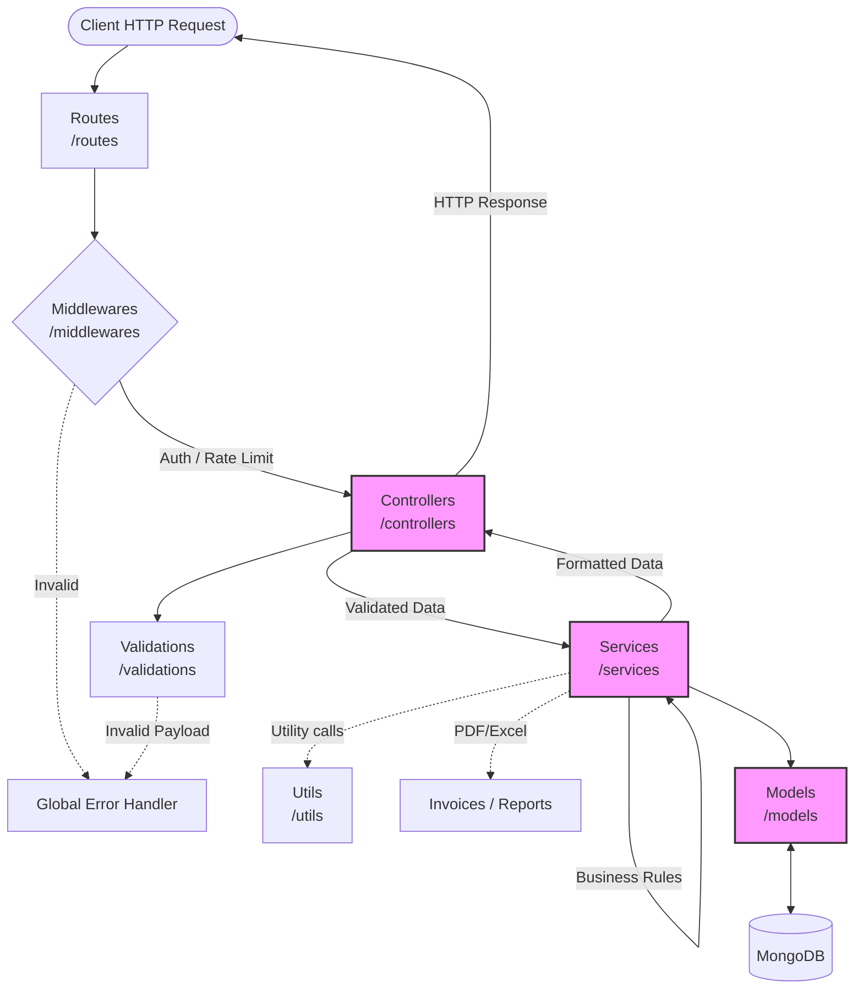

# Backend Architecture & Folder Structure
## Paint Wholesaler ERP System (MERN Stack)

This document details the architecture, directory structure, and request flow for the Node.js/Express.js backend of the ERP system.

---

### 1. Technology Stack
*   **Runtime Environment:** Node.js
*   **Web Framework:** Express.js
*   **Database:** MongoDB
*   **ODM (Object Data Modeling):** Mongoose

---

### 2. Production-Ready Folder Structure

```text
backend/
├── config/          # Environment & Database Configurations
├── controllers/     # Request/Response Handlers
├── services/        # Core Business Logic
├── models/          # Mongoose Database Schemas
├── routes/          # API Route Definitions
├── middlewares/     # Interceptors (Auth, Logging, Error Handling)
├── utils/           # Shared Helpers & Constants
├── validations/     # Request Payload Validators (Joi/Zod)
├── reports/         # Report Generation Logic (Excel/CSV)
├── invoices/        # Invoice Generation Logic & HTML Templates
├── uploads/         # Static File Storage for Uploads
├── server.js        # Main Application Entry Point
└── package.json     # Dependency Management
```

---

### 3. Folder Responsibilities

#### `config/`
Stores configuration files used to boot up the application.
*   **Responsibilities:** Establishing the MongoDB connection string, setting up third-party service credentials (like AWS S3 or Email providers), and loading `.env` variables securely.

#### `controllers/`
The traffic directors of the application. They keep the HTTP layer strictly separated from the business logic layer.
*   **Responsibilities:** Receiving incoming HTTP requests, extracting path parameters, query strings, and body payloads, calling the appropriate function in the `services/` layer, and finally returning structured JSON responses and HTTP status codes to the client.

#### `services/`
The heart of the application where all business rules are executed. This ensures the controllers remain "thin" and the logic remains highly reusable.
*   **Responsibilities:** Complex calculations (like GST and Profit), interacting with multiple Mongoose models simultaneously (e.g., deducting stock when a sale is made), and orchestrating background tasks. 

#### `models/`
The data access layer representing the database schema.
*   **Responsibilities:** Defining Mongoose schemas, setting default values, enforcing data types, and setting up indexes and pre/post save hooks (e.g., automatically generating an `invoiceNumber` before saving a Sale).

#### `routes/`
Maps URL endpoints to specific controller methods.
*   **Responsibilities:** Grouping endpoints logically (e.g., all `/api/products` routes together) and attaching necessary middlewares (like requiring authentication before allowing a POST request).

#### `middlewares/`
Functions that intercept the HTTP request-response cycle before it reaches the controller.
*   **Responsibilities:** User authentication (verifying JWT tokens), role-based access control (RBAC), global error handling, logging requests, and file upload parsing (using Multer).

#### `utils/`
A collection of stateless, reusable utility functions used across the app.
*   **Responsibilities:** Formatting dates, hashing passwords, generating random strings (for invoice references), and standardizing API error formatting.

#### `validations/`
Ensures that data coming into the server is strictly shaped as expected before hitting controllers or databases.
*   **Responsibilities:** Using libraries like Joi or Zod to validate request bodies. For example, ensuring `mobileNumber` is exactly 10 digits and `gstPercentage` is a valid number.

#### `reports/`
Specialized logic for data aggregation and formatting.
*   **Responsibilities:** Housing the heavy MongoDB aggregation pipelines used to summarize monthly sales or stock levels, and formatting that data into downloadable Excel or CSV files.

#### `invoices/`
Dedicated to the formatting and creation of formal PDF documents.
*   **Responsibilities:** Storing HTML/Handlebars templates for GST-compliant invoices and purchase orders, and handling the logic to convert these templates into PDF buffers using tools like Puppeteer or PDFKit.

#### `uploads/`
A local storage directory.
*   **Responsibilities:** Storing temporary files (like bulk Excel imports before they are processed) or persistent files (like user avatars or product images, if not using a cloud bucket like S3).

---

### 4. Architecture Diagram (Request Flow)

The following diagram illustrates the unidirectional data flow pattern (Controller -> Service -> Model) which ensures maximum scalability and maintainability.


